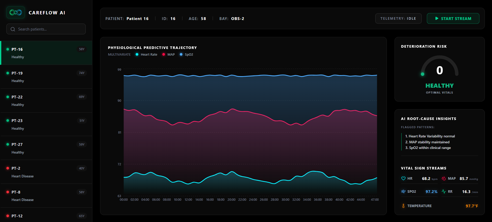

# 📈 CareFlow AI: Predictive Telemetry & Clinical Decision Support System

CareFlow AI is an enterprise-grade, full-stack predictive healthcare dashboard designed to mitigate clinical **Alarm Fatigue** in intensive care environments. By replacing traditional, isolated metric alerts with a multivariate Deep Learning pipeline, CareFlow AI tracks complex physiological trajectories over a rolling 24-hour window to predict multi-system patient deterioration before it occurs.



---

## 🚀 Live Access
* **Frontend Dashboard (Vercel):** https://care-flow-ai-lstm.vercel.app/
* **AI Telemetry Backend (Render):** https://careflow-ai-924b.onrender.com

---

## 🧠 Architectural Overview

CareFlow AI operates as a unified platform leveraging a **monorepo architecture** that splits cleanly into a data-driven prediction pipeline and a high-performance clinical dashboard.

```

├── backend                # Django + TensorFlow Inference Framework
├── frontend               # React + TypeScript + Tailwind UX Layer
└── public                 # Cover page

```

### 1. The Machine Learning Engine (`/backend`)
* **Core Network:** A multi-layered **Long Short-Term Memory (LSTM)** neural network trained on dynamic, high-frequency patient monitoring telemetry datasets.
* **Multivariate Vector Analysis:** Instead of evaluating metrics in isolation, the model analyzes rolling temporal correlation matrices between **Heart Rate (HR)**, **Mean Arterial Pressure (MAP)**, and **Oxygen Saturation (SpO2)**.
* **Inference Pipeline:** Implemented using **TensorFlow** and **Scikit-Learn** encoders built on a production-hardened **Django REST Framework** gateway.

### 2. The Clinical Dashboard UI (`/frontend`)
* **Real-Time Telemetry Stream:** Built using highly responsive **Recharts** area components capable of mapping fluid physiological data vectors over time.
* **Deterioration Risk Gauge:** A localized SVG-rendered arc tracking current structural decay probability index scores ($0\% - 100\%$).
* **Root-Cause Telemetry Terminal:** An automated heuristic window parsing localized downstream anomalies into immediate, actionable tactical logs for attending staff.

---

## 🛠️ Key Technical Solved Challenges

During development and cloud provisioning, the following critical system optimizations were implemented:

* **Multivariate Dependency Balancing:** Orchestrated a specific environment floor-and-ceiling lock down using **Python 3.12.8** to resolve compilation conflicts between Django 6.x ($>= 3.12$) and TensorFlow ($< 3.13$).
* **Anti-Wrapping Micro-Grid Typography:** Re-engineered the vital signs presentation into a dense, non-wrapping dynamic CSS Grid (`grid-cols-2`). Embedded `whitespace-nowrap` locks and auto-calculated formatting flags (`.toFixed(1)`) ensuring 3-digit blood pressures ($120.0+$ mmHg) never break component layout boundaries.
* **Dynamic Network Fallbacks:** Developed an adaptive fallback protocol within the React environment layer (`import.meta.env.VITE_API_URL || 'http://127.0.0.1:8000'`) to enable seamless execution both on local staging loops and production clusters.

---

## 💻 Local Installation & Setup

### Prerequisites
* Python 3.12.x
* Node.js (v18+)
* npm

### 1. Backend Setup

```bash
cd backend
python -m venv venv  # Create and activate virtual environment
source venv/bin/activate  # On Windows: venv\Scripts\activate

pip install -r requirements.txt  # Install dependencies

python manage.py migrate  # Run migrations and start development server
python manage.py runserver

```

### 2. Frontend Setup

```bash
cd frontend
npm install  # Install node packages

npm run dev  # Start Vite hot-reloading development server

```

---

## 🧪 Tech Stack Summary

* **Frontend:** React 18, TypeScript, Tailwind CSS, Lucide Icons, Recharts, Axios
* **Backend:** Python 3.12, Django, Django REST Framework, Gunicorn
* **Data Science / ML:** TensorFlow, Keras, NumPy, Pandas, Scikit-Learn
* **Cloud Infrastructure:** Vercel (Frontend), Render (Production WSGI Backend Engine)